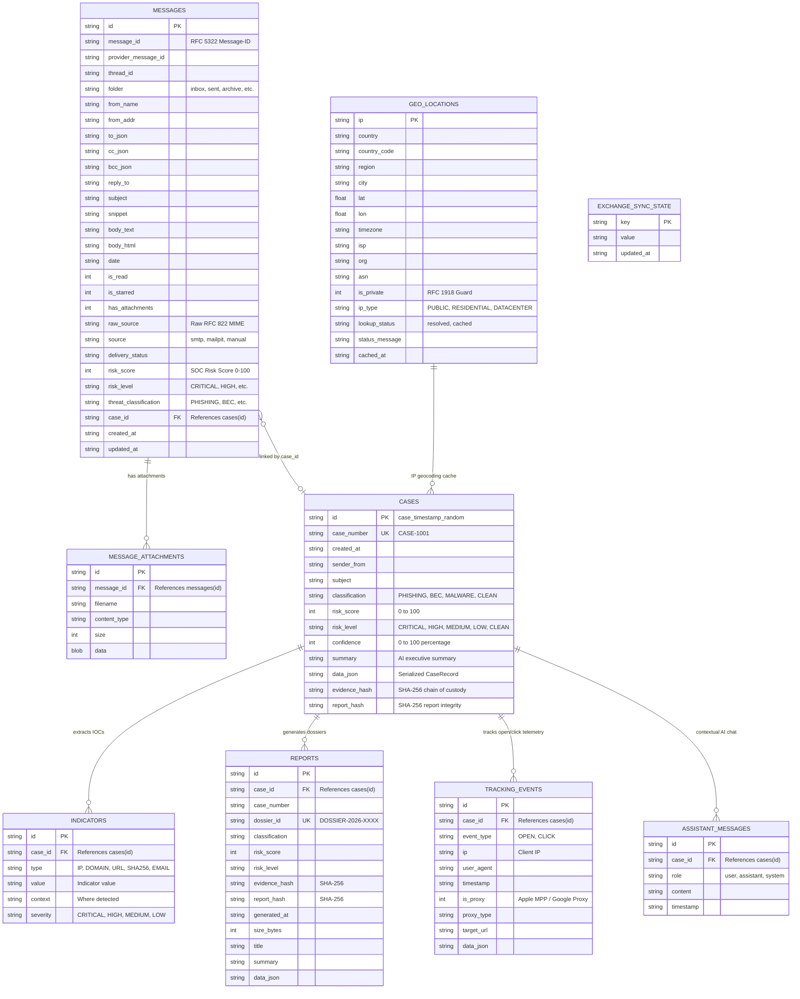

# 🗄️ MailTrace AI - Database Architecture & Data Dictionary

MailTrace AI utilizes a unified, high-performance embedded relational database powered by Node.js 22 native **`node:sqlite` (`DatabaseSync`)**. It features **Write-Ahead Logging (WAL)** and concurrency locks that allow both the **SOC Threat Intelligence Engine** (Port 5000) and the **Enterprise Webmail Exchange** (Port 5001) to interact with the database without lock contention.

- **Primary Database File**: `server/data/mailtrace.db`
- **Engine**: SQLite 3 (Node.js 22 built-in `node:sqlite`)
- **Journal Mode**: `PRAGMA journal_mode = WAL;` (Concurrent readers + writer)
- **Busy Timeout**: `PRAGMA busy_timeout = 5000;` (5-second lock queue)

---

## 1. Entity-Relationship (ER) Diagram

---

## 2. Table Data Dictionaries

### 1. `cases` (SOC Threat Intelligence & Forensics)
Stores complete analytical forensic cases created by the detection pipeline.

| Column | Type | Constraints | Description |
|---|---|---|---|
| `id` | `TEXT` | `PRIMARY KEY` | Unique ID (e.g. `case_1725628100_abc12`) |
| `case_number` | `TEXT` | `UNIQUE NOT NULL` | Human-readable sequential ID (e.g. `CASE-1042`) |
| `created_at` | `TEXT` | `NOT NULL` | ISO 8601 UTC creation timestamp |
| `sender_from` | `TEXT` | `NOT NULL` | Full RFC 822 sender string (`Name <user@domain>`) |
| `subject` | `TEXT` | `NOT NULL` | Email subject line |
| `classification`| `TEXT` | `NOT NULL` | `PHISHING`, `SUSPICIOUS`, `BEC`, `MALWARE`, `CLEAN` |
| `risk_score` | `INTEGER`| `NOT NULL` | Calibrated fusion score between `0` and `100` |
| `risk_level` | `TEXT` | `NOT NULL` | Severity tier: `CRITICAL`, `HIGH`, `MEDIUM`, `LOW`, `CLEAN` |
| `confidence` | `INTEGER`| `NOT NULL` | Detection confidence percentage (e.g. `92`%) |
| `summary` | `TEXT` | `NOT NULL` | AI forensic executive summary |
| `data_json` | `TEXT` | `NOT NULL` | Serialized JSON containing all 7 model breakdowns & findings |
| `evidence_hash`| `TEXT` | `NOT NULL` | **SHA-256 hash** of all headers, hops, and evidence payload |
| `report_hash` | `TEXT` | `NOT NULL` | **SHA-256 hash** sealing the final verdict |

- **Indices**: `idx_cases_created` (`created_at DESC`)

---

### 2. `indicators` (Indicators of Compromise / IOCs)
Normalized threat artifacts extracted from analyzed emails for threat hunting.

| Column | Type | Constraints | Description |
|---|---|---|---|
| `id` | `TEXT` | `PRIMARY KEY` | Unique UUID |
| `case_id` | `TEXT` | `NOT NULL, FK` | References `cases(id) ON DELETE CASCADE` |
| `type` | `TEXT` | `NOT NULL` | Type: `IP`, `DOMAIN`, `URL`, `SHA256`, `EMAIL` |
| `value` | `TEXT` | `NOT NULL` | Observed IOC (e.g., `https://evil-login.cfd`, `194.168.1.5`) |
| `context` | `TEXT` | `NOT NULL` | Context: `Body Link`, `Originating Relay`, `Attachment` |
| `severity` | `TEXT` | `NOT NULL` | Severity rating: `CRITICAL`, `HIGH`, `MEDIUM`, `LOW` |

- **Indices**: `idx_indicators_case`, `idx_indicators_type`, `idx_indicators_val`

---

### 3. `messages` (Enterprise Webmail & SOC Junction)
Stores mailbox messages for the enterprise Exchange client, automatically enriched with SOC threat intelligence.

| Column | Type | Constraints | Description |
|---|---|---|---|
| `id` | `TEXT` | `PRIMARY KEY` | Internal message UUID |
| `message_id` | `TEXT` | `NULLABLE` | RFC 5322 `Message-ID` header |
| `provider_message_id`| `TEXT` | `NULLABLE` | External mail server ID (e.g. Mailpit ID) |
| `thread_id` | `TEXT` | `NULLABLE` | Conversation thread grouping ID |
| `folder` | `TEXT` | `NOT NULL` | `inbox`, `sent`, `archive`, `trash`, `spam` |
| `from_name` | `TEXT` | `NULLABLE` | Display name of sender |
| `from_addr` | `TEXT` | `NOT NULL` | Sender email address |
| `to_json` | `TEXT` | `NOT NULL` | JSON array of recipient objects |
| `subject` | `TEXT` | `NULLABLE` | Message subject line |
| `snippet` | `TEXT` | `NULLABLE` | Text preview (first 150 characters) |
| `body_text` | `TEXT` | `NULLABLE` | Decoded plain text body |
| `body_html` | `TEXT` | `NULLABLE` | Decoded HTML body |
| `date` | `TEXT` | `NOT NULL` | Email transmission timestamp |
| `is_read` | `INTEGER`| `DEFAULT 0` | Read receipt boolean (`0` or `1`) |
| `is_starred` | `INTEGER`| `DEFAULT 0` | Starred boolean (`0` or `1`) |
| `raw_source` | `TEXT` | `NULLABLE` | Original, unedited RFC 822 MIME payload |
| `risk_score` | `INTEGER`| `NULLABLE` | Injected SOC risk score (`0-100`) |
| `risk_level` | `TEXT` | `NULLABLE` | Injected SOC severity (`CRITICAL`, `HIGH`, `Clean`) |
| `threat_classification` | `TEXT` | `NULLABLE` | Injected verdict (`PHISHING`, `CLEAN`, etc.) |
| `case_id` | `TEXT` | `NULLABLE` | Link to forensic record in `cases(id)` |

- **Indices**: `idx_messages_folder`, `idx_messages_date`, `idx_messages_msg_id`, `idx_messages_sender`, `idx_messages_risk`

---

### 4. `geo_locations` (Geolocation & Autonomous System Cache)
Maintains local GeoIP enrichment with a 7-day TTL cache to minimize external network requests.

| Column | Type | Constraints | Description |
|---|---|---|---|
| `ip` | `TEXT` | `PRIMARY KEY` | Public IP address |
| `country` | `TEXT` | `NOT NULL` | Resolved country name |
| `city` | `TEXT` | `NULLABLE` | Resolved city |
| `lat` / `lon` | `REAL` | `NULLABLE` | Latitude / Longitude coordinates |
| `timezone` | `TEXT` | `NULLABLE` | Local timezone (e.g. `America/New_York`) |
| `asn` | `TEXT` | `NULLABLE` | Autonomous System Number (e.g. `AS15169`) |
| `isp` / `org` | `TEXT` | `NULLABLE` | Internet Service Provider / Organization |
| `is_private` | `INTEGER`| `DEFAULT 0` | Strict guard (`1` = RFC 1918; no coordinates fabricated) |
| `ip_type` | `TEXT` | `DEFAULT 'PUBLIC'` | `PUBLIC`, `DATACENTER`, `RESIDENTIAL`, `VPN` |
| `cached_at` | `TEXT` | `NOT NULL` | Timestamp when entry was resolved |

---

### 5. `reports` (Forensic Dossiers & Exportable Reports)
Generated exportable incident reports with cryptographic verification.

| Column | Type | Constraints | Description |
|---|---|---|---|
| `id` | `TEXT` | `PRIMARY KEY` | Report UUID |
| `case_id` | `TEXT` | `FK` | References `cases(id) ON DELETE CASCADE` |
| `case_number`| `TEXT` | `NOT NULL` | E.g. `CASE-1042` |
| `dossier_id` | `TEXT` | `UNIQUE NOT NULL` | Unique dossier ID (`DOSSIER-2026-0042`) |
| `evidence_hash`| `TEXT` | `NOT NULL` | Cryptographic evidence proof |
| `report_hash`| `TEXT` | `NOT NULL` | Cryptographic report verdict proof |
| `generated_at`| `TEXT` | `NOT NULL` | Timestamp |
| `size_bytes` | `INTEGER`| `NOT NULL` | Report file size |
| `data_json` | `TEXT` | `NOT NULL` | Serialized full report content |

---

### 6. `tracking_events` (Live Telemetry & Interaction Profiling)
Stores email interaction events (open tracking pixels and link clicks).

| Column | Type | Constraints | Description |
|---|---|---|---|
| `id` | `TEXT` | `PRIMARY KEY` | Event UUID |
| `case_id` | `TEXT` | `NOT NULL` | Associated case ID |
| `event_type` | `TEXT` | `NOT NULL` | `OPEN` or `CLICK` |
| `ip` | `TEXT` | `NOT NULL` | Client interaction IP address |
| `user_agent` | `TEXT` | `NULLABLE` | Client User-Agent |
| `timestamp` | `TEXT` | `NOT NULL` | UTC event timestamp |
| `is_proxy` | `INTEGER`| `DEFAULT 0` | `1` if detected as Apple MPP or Google Image Proxy |
| `proxy_type` | `TEXT` | `NULLABLE` | `APPLE_MPP`, `GOOGLE_PROXY`, or `NONE` |

---

## 3. Key Architectural Design Highlights

1. **Zero-Configuration, Self-Contained Deployment**:
   Uses Node.js 22 built-in `node:sqlite` (`DatabaseSync`), requiring **zero native C++ compilers**, external database services, or container orchestration.
2. **Concurrent Multi-Process Access**:
   Enabled via `PRAGMA journal_mode = WAL` and a 5-second `busy_timeout`. Both the SOC server (port 5000) and the Exchange webmail server (port 5001) query and update the same SQLite database without locking conflicts.
3. **Chain of Custody & Tamper Evident Integrity**:
   Every case and report stores independent `evidence_hash` and `report_hash` values computed via SHA-256. If any record is modified post-analysis, the hash mismatch is immediately detected.
4. **Strict RFC 1918 Private Address Suppression**:
   The `geo_locations` table strictly flags private, loopback, and CGNAT IP addresses (`10.x`, `192.168.x`, `127.x`), enforcing **zero coordinate fabrication** and preventing false geolocation alerts.
