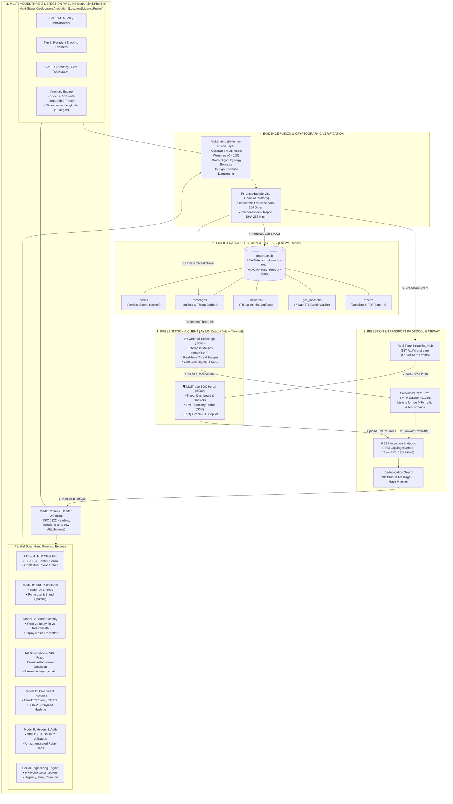

# 🏛️ MailTrace AI - Unified End-to-End System Architecture

A single, consolidated architectural model demonstrating the complete flow of data from email ingestion and transport protocols, through the multi-model forensic analysis engines, to the unified database and real-time presentation layers.

---

## 📐 Unified System Architecture Diagram

---

## 🧩 Architectural Layers & Responsibilities

| Layer | Component | Function & Role |
|---|---|---|
| **Layer 1: Presentation** | **SOC Portal (`:5000`) & Exchange (`:5001`)** | Single-page React applications providing security operations monitoring, interactive threat graphs, AI copilot chat, and employee email clients with real-time risk badges. |
| **Layer 2: Protocol Gateway** | **Embedded SMTP Daemon (`:1025`) & REST Ingestion** | Handles incoming mail delivery using RFC 5321, captures unedited MIME streams, prevents duplicate processing via a 30-second burst cache, and drives SSE telemetry. |
| **Layer 3: Threat Engines** | **7 Forensic Models + Geolocation Engine** | Analyzes email attributes concurrently: textual sentiment (Model A), URL entropy (Model B), sender spoofing (Model C), BEC heuristics (Model D), file payload hazards (Model E), and SPF/DKIM/DMARC alignment (Model F). |
| **Layer 4: Fusion & Cryptography** | **RiskEngine & ForensicHashService** | Combines all model signals using calibrated scoring matrices and synergy escalations. Seals each case with SHA-256 evidence and verdict digests. |
| **Layer 5: Unified Data Layer** | **SQLite (`mailtrace.db`) with WAL Mode** | A single relational database shared between the SOC platform and webmail exchange. Uses Write-Ahead Logging to guarantee concurrent access without database locks. |

---

## ⏱️ 30-Second Jury Pitch for this Model

> *"MailTrace AI is structured as a **5-layer modular architecture**:*
> 1. *At the top, we have our **Presentation Layer** with dual React frontends for SOC analysts and enterprise employees.*
> 2. *Our **Transport Gateway** ingests email via an embedded RFC 5321 SMTP daemon or REST endpoint, with built-in burst deduplication.*
> 3. *Our **Analysis Layer** evaluates the message across 7 specialized forensic models and a 3-tier geolocation attribution engine that detects impossible physical travel.*
> 4. *Our **Evidence Fusion Layer** synthesizes the scores and seals the case with cryptographic SHA-256 hashes to maintain forensic chain-of-custody.*
> 5. *Finally, our **Unified Data Layer** uses Node 22 native SQLite in WAL mode, concurrently syncing threat scores to the webmail inbox while streaming live telemetry to the SOC screen via Server-Sent Events."*
